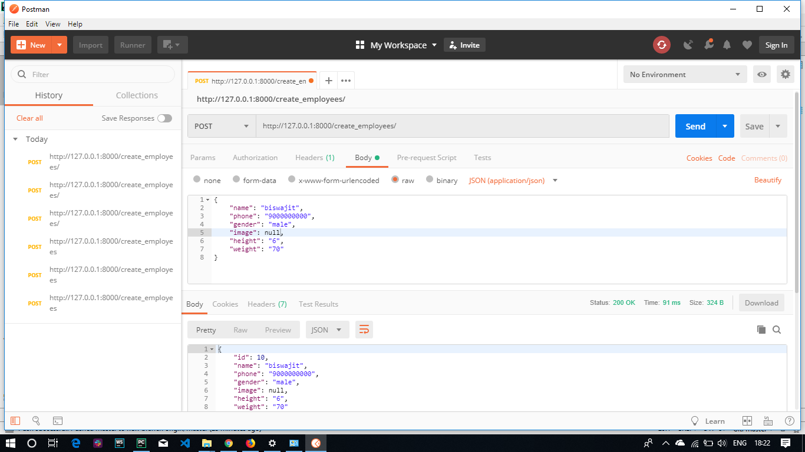
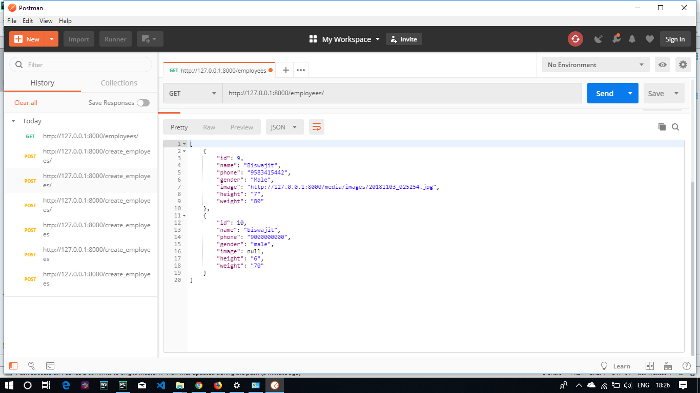
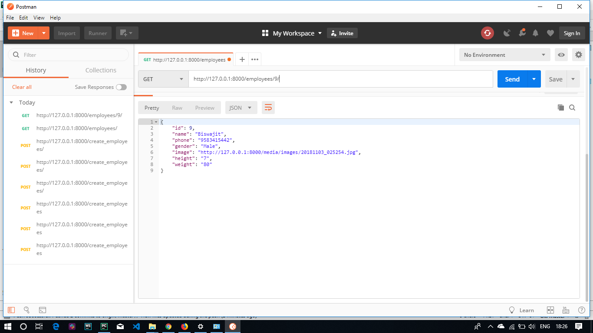
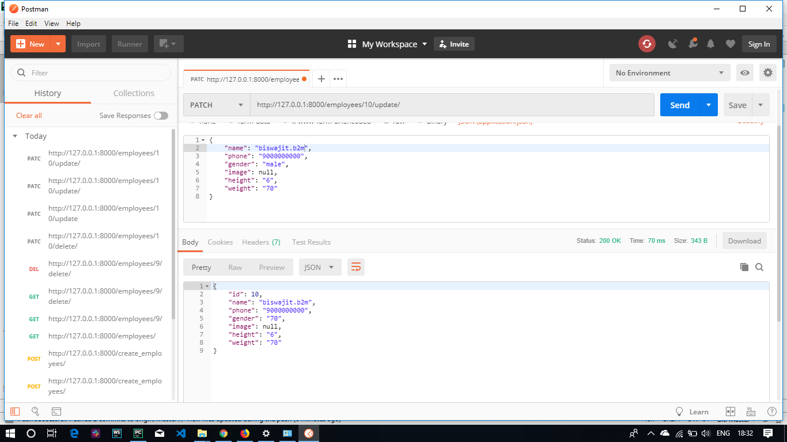
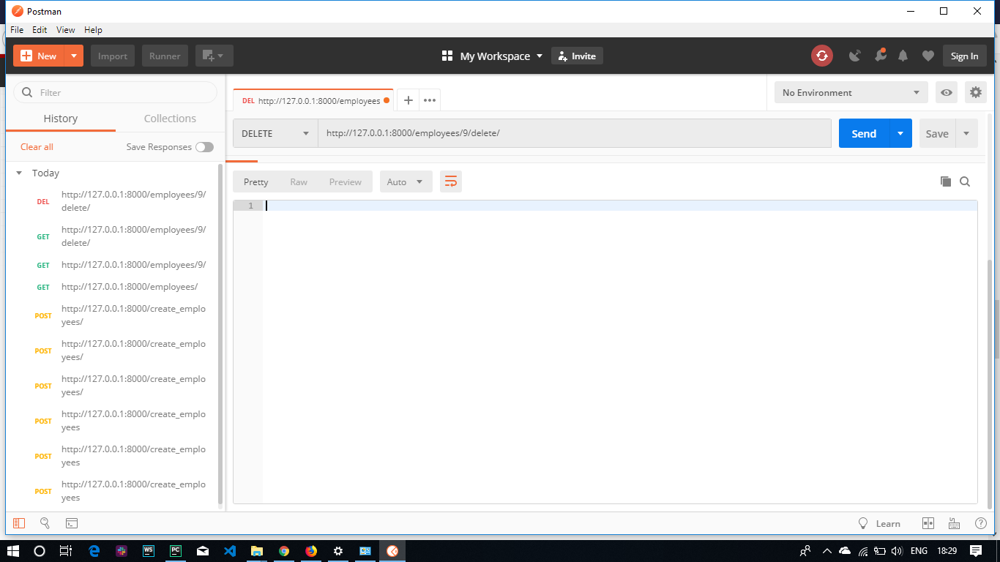

# Django-Rest-Framework
Learn how to build your own REST API with Python, Django, and the Django Rest Framework.

In this project i have build the API for a employee app featuring CRUD (Create-Read-Update-Delete) functionality with Django Rest Framework.

step-1 : make a environment and install djangorestframework==3.9.1

step-2 : python manage.py makemigrations

step-3 : python manage.py migrate

step-4 : python manage.py createsuperuser

step-5 : python manage.py runserver

screen:

